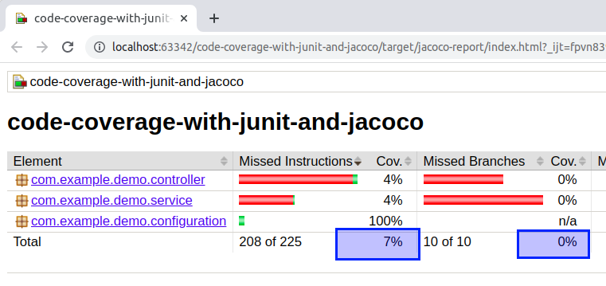

CODE COVERAGE WITH JACOCO
--------------------------------------------------------------------------

Measuring code coverage with the Java Code Coverage Library (JaCoCo).

--------------------------------------------------------------------------

**JaCoCo plugin added to pom.xml file:**

```

    <plugin>
        <groupId>org.jacoco</groupId>
        <artifactId>jacoco-maven-plugin</artifactId>
        <version>0.8.5</version>
        <configuration>
            <excludes>
                <exclude>com/example/demo/CodeCoverageWith*</exclude>
                <exclude>com/example/demo/dto/*</exclude>
                <exclude>com/example/demo/dto/response/*</exclude>
                <exclude>com/example/demo/model/*</exclude>
                <exclude>com/example/demo/repository/*</exclude>
            </excludes>
        </configuration>
        <executions>
            <execution>
                <goals>
                    <goal>prepare-agent</goal>
                </goals>
            </execution>
            <!-- attached to Maven test phase -->
            <execution>
                <id>report</id>
                <phase>test</phase>
                <goals>
                    <goal>report</goal>
                </goals>
                <configuration>
                    <outputDirectory>target/jacoco-report</outputDirectory>
                </configuration>
            </execution>
        </executions>
    </plugin>

```

**Some packages were exluded from JaCoCo:**

```
    <excludes>
        <exclude>com/example/demo/CodeCoverageWith*</exclude>
        <exclude>com/example/demo/dto/*</exclude>
        <exclude>com/example/demo/dto/response/*</exclude>
        <exclude>com/example/demo/model/*</exclude>
        <exclude>com/example/demo/repository/*</exclude>
    </excludes>
```

**Location where the report will be generated:**

```
    <configuration>
        <outputDirectory>target/jacoco-report</outputDirectory>
    </configuration>
```

--------------------------------------------------------------------------

**After JaCoco plugin is added, the test maven phase is executed:**


**A report is generated in the directory target/jacoco-report:**


**Right now, the report says there is a code coverage of 7% in missed instructions and 0% in missed branches:**




--------------------------------------------------------------------------